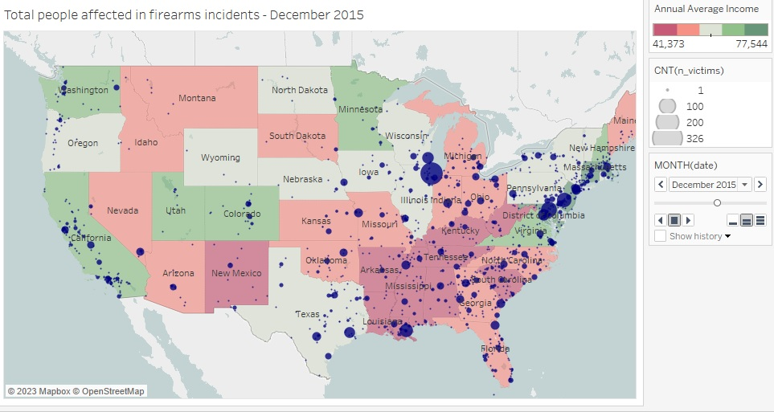
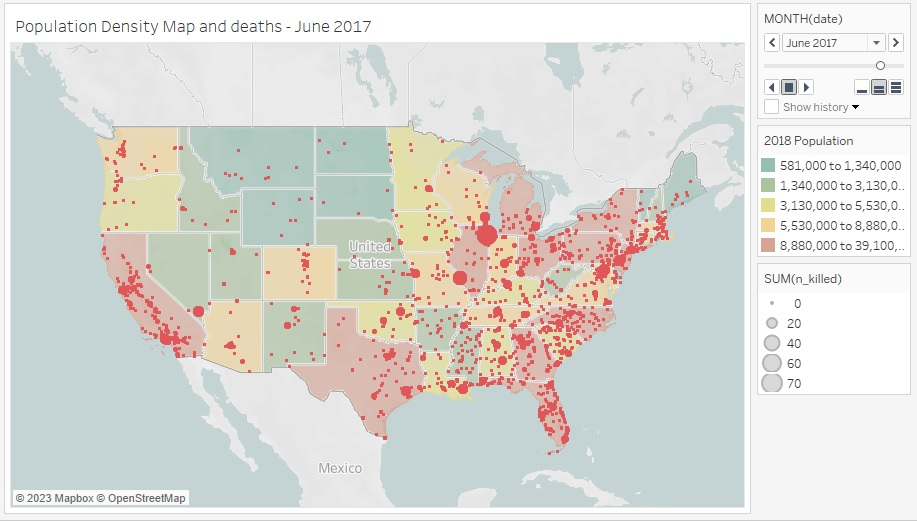

# This is America 
#### Gun related incidents analisys - Project IV: Tableau

## Introduction
This project aims to demonstrate:
- ETL
- EDA
- WebScraping
- Visualization using Tableau

For this demonstration a dataset uploaded in Kaggle will be used as source material with data from gunviolencearchive.org in addition to avarage annual salary data for US states for the year 2018 extracted from wikipedia.

[Gun Violence Data](https://www.kaggle.com/datasets/jameslko/gun-violence-data)

[Wiki Table - US salaries 2018-2013](https://en.wikipedia.org/wiki/List_of_U.S._states_and_territories_by_income)

## Description
Provided the information on the dataframe, this project investigates the following:
1. Correlation of annual average income with density of firearms incidents.
2. Investigate if the **Fix Gun Checks Act of 2015** (July 29, 2015) and the **Background Check Completion Act.**(Oct. 5, 2017) had any effect in the avarege of incidents with firearms.
3. What is the primary reported cause of incidents with firearms?

In order to compare the number of incidents with firearms to the annual average income from each state, the average of this 6 years was calculated to use as reference.

The database chosen had a lot of information put together in each row value, so many transformations of data was needed to separate people's information and to sort incident types, wich had some inconsistencies.

## Conclusions
Some conclusions we draw from observing the plotted information:
1. This database covers a period from 2013 to 2018 but data from all mainland states is only fully reported after 2014. For this reason, data from 2013 wil be excluded from any analisys comparing years.
2. A great part of the incidents are reported in inconsistent subtypes and overlapping with each other. Type `Shots - Wounded/Injured` seems to be a generic expression for "uncertain circustances". 

### Tableau
The first maps tries to correlate the number of incidents with firearms with the average income:

As shown, no correlation was found. Firearms incidents occur in either low or high income average areas.

Then the second map tries to find correlation between population density and deaths by firearm.

This demographic information is extracted directly from tableau maps. Areas more densily populates tend to have more deaths by firearms.

Investigating the second topic:

Here is link with interactive charts.
[Tableau Link](https://public.tableau.com/app/profile/paula.machado6180/viz/ProjectIV_16846028469340/ThisisAmerica-ProjectIV-Tableau?publish=yes)

## Technologies
For this project:
- Pandas
- BeautifulSoup
- Requests module
- Tableau